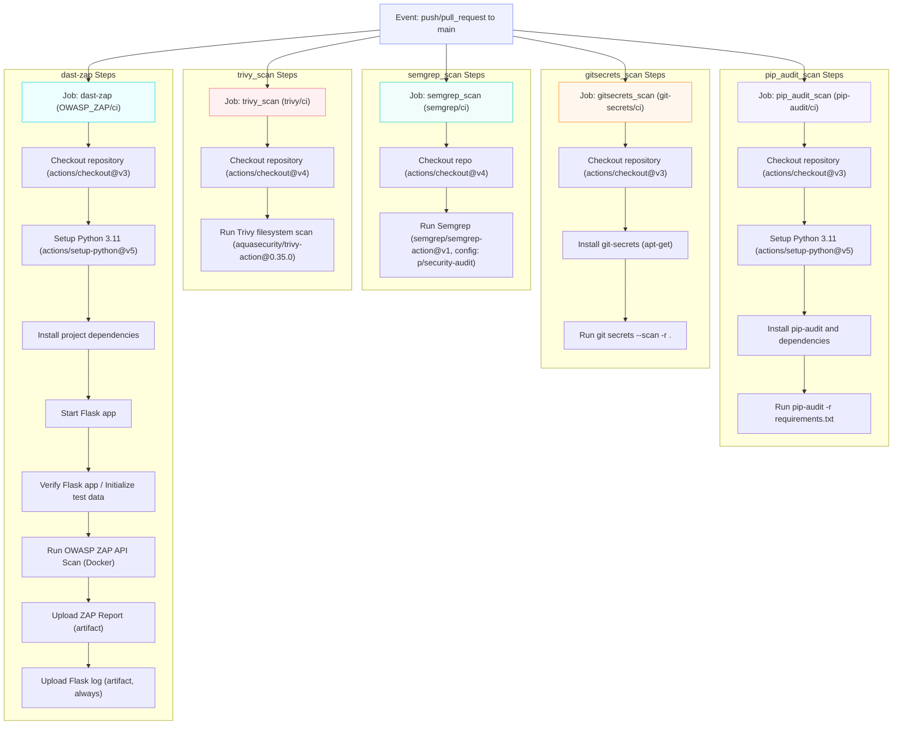

# api-security-pipeline-demo

A deliberately vulnerable Flask API project demonstrating how to identify, validate, and detect common OWASP API security failures in a CI/CD workflow.

## Purpose

This repository simulates a realistic backend service used by multiple customer organizations (tenants) sharing a single API and datastore. It demonstrates how an Application Security engineer can:

- Identify and prioritize API security risks
- Guide secure backend implementation patterns
- Integrate security tooling into CI/CD
- Reduce regressions through automation

## App Context

This project is based on VAmPI, a deliberately vulnerable Flask API designed to demonstrate OWASP API security issues. 

In this version, the focus is on showcasing how security tooling detects and validates API vulnerabilities rather than documenting full application behavior.

## Primary Vulnerabilities Demonstrated

This project currently focuses on four concrete API security issues present in the vulnerable implementation:

- VULN-01: Broken Object Level Authorization (BOLA)
- VULN-02: Excessive Data Exposure
- VULN-03: User Enumeration
- VULN-04: Unauthorized password change

Additional API security issues exist in the upstream VAmPI codebase, but this repo intentionally centers on four scenarios for secure coding, detection, and CI/CD validation.


## Why This Repo Exists

This repo demonstrates how security tooling and pipeline automation surface API security issues with developer-friendly output:

- SAST (Semgrep)
- DAST (OWASP ZAP)
- SCA (pip-audit)
- Secrets detection (git-secrets)
- AI-assisted authorization review (Ollama)
- Clear CI feedback

## CI/CD Security Workflow


## Developer Experience Goal

Findings are surfaced with clear descriptions, affected endpoints, and actionable remediation guidance so developers can fix issues quickly without deep security expertise.

## AI-Assisted Authorization Review

This repository includes an experiment evaluating whether a locally hosted LLM can identify authorization flaws that may be missed by traditional static analysis tools.

### Experiment Summary

- Tool: Ollama + qwen2.5-coder:7b
- Local execution only
- No source code sent to external AI providers
- Human validation required

### Result

The model successfully identified a Broken Access Control / Broken Object Level Authorization (BOLA) password update flaw that was not detected by Bandit.

Human review confirmed the finding and corrected the OWASP classification generated by the model.

This experiment demonstrates how AI-assisted review can complement traditional security tooling when evaluating authorization logic and business logic vulnerabilities.

Additional documentation:

- `docs/ai-governance.md`
- `docs/ai-review-output/authz-review-local.md`

## Primary Scenarios

- VULN-01:`GET /users/v1/{username}` → Broken Object Level Authorization (BOLA)
- VULN-02:`GET /users/v1/_debug` → Excessive Data Exposure
- VULN-03:`POST /users/v1/login` → User Enumeration
- VULN-04:`PUT /users/v1/{username}/password` → Unauthorized Password Change

---

## Repository Structure

```
api-security-pipeline-demo/
├── api_views/
├── models/
├── openapi_specs/
├── docs/
│   ├── ai-governance.md
│   └── ai-review-output/
│       └── authz-review-local.md
├── prompts/
│   └── authz_review_prompt.txt
├── examples/
│   └── password_change_snippet.py
└── .github/
    └── workflows/
```

## Philosophy

This project models how security integrates into a product engineering workflow:

- Realistic backend API patterns
- Developer-friendly remediation guidance
- Practical security automation
- Clear separation of vulnerable vs fixed implementations

Goal: demonstrate senior-level AppSec thinking  
Security that enables teams while preventing regression.

---

### Status

- Vulnerable scenarios implemented
- SAST integration in progress
- OWASP ZAP API DAST integrated using the OpenAPI specification
- Automated scans import documented endpoints and check for header issues, error leakage, auth weaknesses, and common API/web vulnerabilities
- Local AI-assisted authorization review experiment completed using Ollama

## How to Run

1 - Clone repo
```
git clone https://github.com/dgdemo/api-security-pipeline-demo.git

cd api-security-pipeline-demo
```

2 - Set up Python environment
```
python3 -m venv .venv

source .venv/bin/activate   # mac/linux
# .venv\Scripts\activate    # windows

export SECRET_KEY=[dev-local-secret]
pip install -r requirements.txt
```
3 - Run the vulnerable API
```
python app.py
```
API will start on:
```
http://127.0.0.1:5000
```
Swagger docs are at:
```
http://127.0.0.1:5000/ui
```

## Initialize Test Data before running. Hit this endpoint to reset test data after changing db values (e.g., password change)
```
curl http://127.0.0.1:5000/createdb
```

## Example Requests (Vulnerable Behavior)

## VULN-01: Broken Object Level Authorization (BOLA)
### Accessing different user records by changing the path parameter. 
Impact: Any authenticated user can access other users’ data by modifying the path parameter.
```
curl http://127.0.0.1:5000/users/v1/name1
curl http://127.0.0.1:5000/users/v1/name2
```

## VULN-02: Excessive Data Exposure (via Debug Endpoint)

Impact: Returns full user records including sensitive fields (passwords).
```
curl http://127.0.0.1:5000/users/v1/_debug
```
## VULN-03: User Enumeration
Impact: Different error messages reveal whether a username exists, allowing attackers to enumerate valid accounts.
```
curl -s -X POST http://127.0.0.1:5000/users/v1/login \
  -H "Content-Type: application/json" \
  -d '{"username":"name1","password":"wrong"}'

curl -s -X POST http://127.0.0.1:5000/users/v1/login \
  -H "Content-Type: application/json" \
  -d '{"username":"doesnotexist","password":"wrong"}'
```
## VULN-04: Unauthorized Password Change
### 1. Login to get token
```
TOKEN=$(curl -s -X POST http://127.0.0.1:5000/users/v1/login \
  -H "Content-Type: application/json" \
  -d '{"username":"name1","password":"pass1"}' | jq -r '.auth_token')
```
### Verify:
```
echo $TOKEN
```
### 2. Use token to modify another user's password
Impact: Authenticated user can modify another user’s credentials.
```
curl -X PUT \
  -H "Authorization: Bearer $TOKEN" \
  -H "Content-Type: application/json" \
  -d '{"password":"NewPassword123"}' \
  http://127.0.0.1:5000/users/v1/name2/password
```


